# EmotiSpeech · Clasificador de Emociones + Módulo de Toma de Decisiones

Proyecto integrado de dos capas:

1. **Capa de Machine Learning** — clasificación de emociones de voz (Enojo / Feliz / Tranquilidad / Tristeza) a partir de audio, usando un encoder fine-tuneado para reconocimiento de emoción (`audeering/wav2vec2-large-robust-12-ft-emotion-msp-dim`) y clasificadores clásicos sobre sus embeddings.
2. **Capa de Toma de Decisiones** — un módulo analítico construido sobre los resultados del clasificador que simula, evalúa y recomienda un despliegue con justificación cuantitativa de negocio (caso call-center).

La capa de Toma de Decisiones **no modifica** la capa de ML: solo consume los embeddings, las matrices de confusión y las probabilidades ya calculadas.

---

## Tabla de contenido

- [Resumen rápido](#resumen-rápido)
- [Cómo se construyó el clasificador](#cómo-se-construyó-el-clasificador)
- [Capturas de la aplicación](#capturas-de-la-aplicación)
- [Aplicación web — pestañas disponibles](#aplicación-web--pestañas-disponibles)
- [Capa 1 · Machine Learning](#capa-1--machine-learning)
- [Capa 2 · Toma de Decisiones](#capa-2--toma-de-decisiones)
- [Módulos compartidos: config.py y emotion_encoder.py](#módulos-compartidos-configpy-y-emotion_encoderpy)
- [Scripts — referencia completa](#scripts--referencia-completa)
- [Notebook del pipeline](#notebook-del-pipeline)
- [Estructura del proyecto](#estructura-del-proyecto)
- [Uso rápido](#uso-rápido)
- [Dependencias](#dependencias)
- [Contexto académico](#contexto-académico)

---

## Resumen rápido

| Capa | Qué hace | Salida |
|---|---|---|
| ML | Clasifica audio de voz en hasta 4 emociones con embeddings emocionales (1024 dims de audeering) + 6 clasificadores clásicos | Predicción + probabilidades + arousal/valence/dominance |
| Decisiones | Convierte las matrices de confusión y probabilidades en una decisión de negocio (GO / NO-GO, umbral óptimo, VPN esperado) | Recomendación justificada con sensibilidad y Monte Carlo |

**Estado actual.** El modelo desplegado clasifica las 4 clases (Enojo / Feliz / Tranquilidad / Tristeza). La evaluación es **leave-one-audio-out honesta**: se entrena sobre el segmento localizado de cada audio y se evalúa sobre el **audio crudo** (primeros 10 s) del audio dejado fuera. El mejor clasificador es **Regresión Logística** con **0.86 de balanced accuracy honesta** (chance = 0.25).

| Escenario | Clases | Balanced accuracy honesta |
|---|---|---|
| 2 clases | Enojo / Tranquilidad | 0.92 |
| 3 clases | Enojo / Feliz / Tristeza | 0.97 |
| **4 clases (activo)** | Enojo / Feliz / Tranquilidad / Tristeza | **0.86** |

Las 4 clases son viables hoy, donde un *baseline* con encoder fonético colapsaba a ~0.42 (apenas por encima de chance). Como prueba de estrés adicional, **leave-one-collector-out** (entrenar con 4 recolectores y probar sobre el 5º, nunca visto) da ~0.92 en 3 clases.

---

## Cómo se construyó el clasificador

El clasificador es el resultado de varias decisiones de diseño verificadas empíricamente. Esta sección documenta qué se probó, qué falló y por qué el pipeline quedó como está.

### Del encoder fonético al encoder emocional

El primer enfoque usaba `facebook/wav2vec2-base` (embeddings de 768 dims) como encoder. Ese modelo está pre-entrenado para reconocimiento de habla: sus representaciones capturan fonemas y palabras, no prosodia emocional. El síntoma era una brecha grande entre validación interna y *holdout*: la validación cruzada subía hasta ~97 % mientras el desempeño sobre audios no vistos se quedaba en ~50 %. El clasificador aprendía solapamiento de vocabulario entre audios, no la emoción.

La solución fue migrar el encoder a `audeering/wav2vec2-large-robust-12-ft-emotion-msp-dim`, fine-tuneado sobre MSP-Podcast para predecir *arousal / valence / dominance*. Sus 1024 hidden_states son emocionalmente relevantes por diseño. Este cambio fue el factor decisivo para cerrar la brecha de generalización, y volvió viables las 4 clases. El encoder vive en un módulo compartido (`emotion_encoder.py`) que usan el entrenamiento, la auditoría y la inferencia, de modo que las tres capas ven exactamente las mismas representaciones.

### Etiquetas débiles: auditoría con un modelo SER

El dataset es de **emoción actuada** por personas no entrenadas, y una fracción importante de los audios no proyecta la emoción pedida (alguien graba "enojo" en tono neutro). Estas etiquetas ruidosas son la causa raíz de buena parte de los errores tempranos.

Para detectarlas, el script `auditar_etiquetas_ia.py` corre el modelo SER sobre cada audio, extrae A/V/D, mapea esos valores a las 4 clases mediante kernels gaussianos centrados en el punto teórico de cada emoción y compara con la etiqueta humana. La auditoría sirve como segunda opinión para identificar audios cuya etiqueta probablemente no corresponde al contenido. La inspección de los resultados se apoya en `mostrar_todos.py` (scores de todos los audios) y `mostrar_sospechosos.py` (solo los discrepantes).

Una observación: un filtro acústico basado en métricas globales (energía RMS, pitch, brillo espectral, etc.) resulta demasiado tosco para esta tarea — alguien puede hablar suave pero con tensión emocional, y la energía promedio no lo capta. La detección de etiquetas erróneas es responsabilidad exclusiva del modelo SER.

### Localización de segmentos: refinamiento de etiqueta, no cherry-picking

El pipeline procesa los primeros 10 s de cada audio (`MAX_DURATION = 10 s`, un *sweet spot* empírico: audios más largos diluyen la firma emocional con el mean-pool). Pero la emoción no siempre cae en esos primeros 10 s — a veces aparece más adelante en la grabación.

`segmentar_rescate.py` aplica una ventana deslizante de 10 s sobre el audio **completo**, puntúa cada ventana con el modelo emocional y recorta el tramo de mayor score para la clase declarada. El dataset de entrenamiento (`data/procesado/`) son esos segmentos localizados: un recorte de 10 s por audio.

Esta es una distinción central del proyecto, importante para defenderlo:

- Seleccionar **qué audios** entran al entrenamiento (botar los difíciles) **sí** sesga: entrena al modelo a aprender la pista trivial (energía alta → enojo) y rompe la generalización.
- Seleccionar **qué 10 s dentro de cada audio**, conservando **todos** los audios, **no** sesga. La emoción es actuada, así que la etiqueta vale para toda la grabación; en qué tramo le salió mejor al hablante (tras un carraspeo, un arranque dubitativo) es ruido de grabación, no señal de clase. Es localización de emoción / refinamiento de etiqueta débil, equivalente a recortar el silencio inicial de un clip.

El **guardrail obligatorio** que mantiene la honestidad: el *holdout* **nunca** se segmenta. Se entrena sobre los recortes localizados pero se valida sobre audio crudo (`entrenar_procesado.py` reporta ambas métricas lado a lado). Si solo sube la métrica medida sobre los recortes y no la medida sobre el audio crudo, fue inflación, no mejora.

### Evaluación honesta y prueba de estrés

La métrica oficial es **leave-one-audio-out** entrenando sobre el segmento y testeando sobre el audio crudo del audio excluido — sin leakage, ya que el audio de test nunca aparece en training. Como prueba más exigente, **leave-one-collector-out** entrena con 4 recolectores y prueba sobre el 5º, aportando condiciones de grabación y hablantes nunca vistos. Cada audio es de un hablante distinto, de modo que leave-one-audio-out es ya efectivamente leave-one-speaker-out.

### Lecciones acumuladas

1. **Cherry-picking de audios sesga el training.** Filtrar solo los ejemplos "prototípicos" entrena al modelo a aprender la pista trivial (energía) y arruina la generalización.
2. **Validación interna alta + holdout bajo ≠ overfitting normal.** Aquí significaba que el modelo aprendía algo que no era emoción: etiquetas ruidosas o contenido lingüístico.
3. **`wav2vec2-base` es ASR, no SER.** Para clasificación emocional, un encoder fine-tuneado para emoción cambia drásticamente el techo de desempeño en holdout.
4. **Etiquetas humanas ≠ ground truth.** En datasets pequeños con actores no entrenados, una fracción grande de los audios puede no proyectar la emoción pedida. Auditar con un modelo SER pre-entrenado es trabajo previo a comparar algoritmos.
5. **Localizar la emoción dentro de cada audio no es cherry-picking,** siempre que se conserven todos los audios y el holdout no se segmente. Es distinto de filtrar qué audios entran.

---

## Capturas de la aplicación

### Vista general

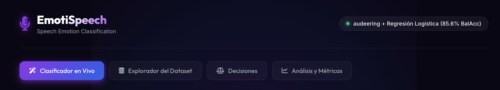

La interfaz tiene 4 pestañas: Clasificador en Vivo, Explorador del Dataset, Análisis y Métricas, y Decisiones.

---

### Pestaña 1 · Clasificador en Vivo

**Entrada de audio** — el usuario puede subir un archivo o grabar directamente desde el navegador.


**Selector de modelo** — elige entre los 6 clasificadores entrenados, ordenados por balanced accuracy honesta.

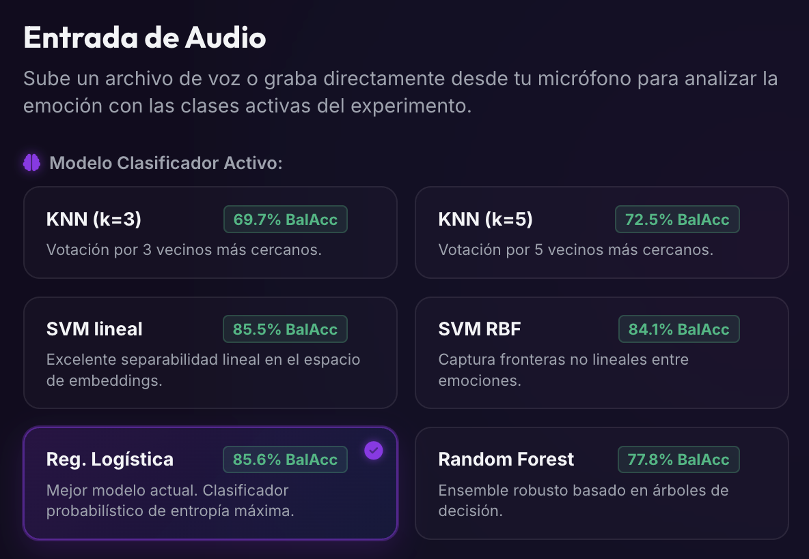

**Resultado del análisis** — predicción con confianza, anillo de probabilidad, barras por clase y métricas (arousal / valence / dominance).

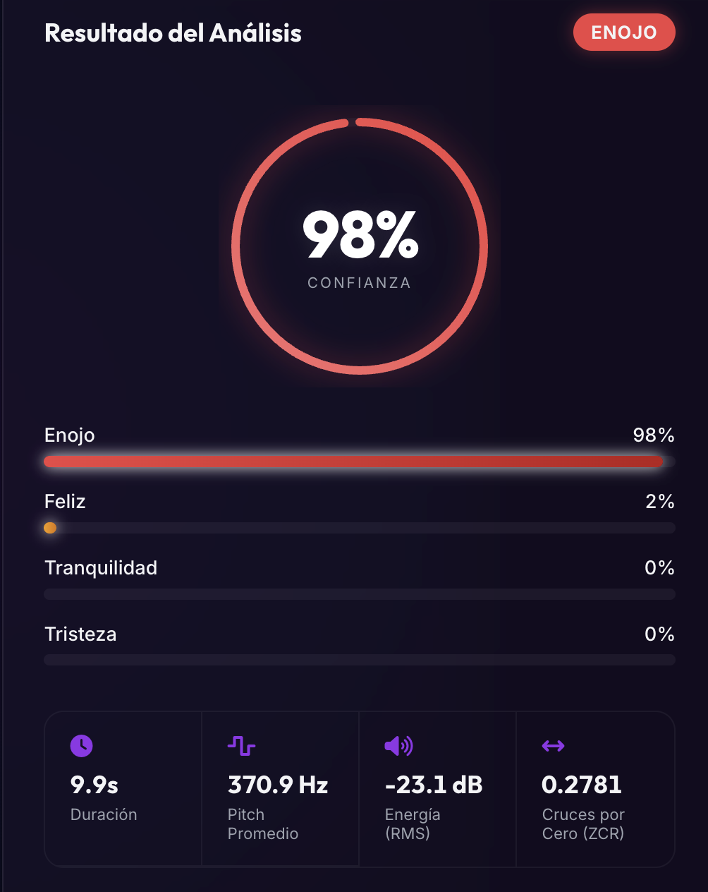

---

### Pestaña 2 · Explorador del Dataset

**Explorador de audios holdout** — reproduce audios reservados (Tranquilidad / Tristeza) que nunca entraron al entrenamiento. Cada predicción es genuinamente out-of-sample.

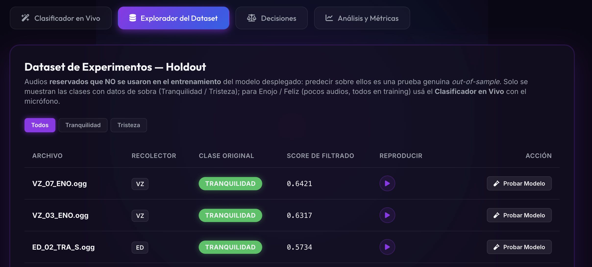

---

### Pestaña 3 · Análisis y Métricas

**Switcher de experimentos** — selecciona entre los escenarios de 2, 3 o 4 clases para ver la matriz de confusión y la separabilidad de embeddings.

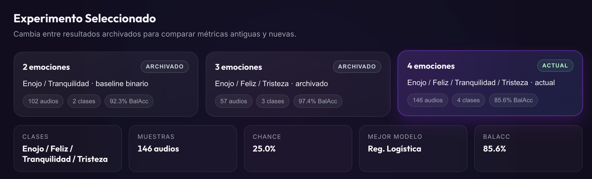

---

### Pestaña 4 · Decisiones

**Vista general del módulo de decisiones** — cuatro fases secuenciales y una recomendación final.


**Fase 1 · Matriz de costos editable** — el usuario parametriza el valor de cada tipo de resultado (TP / FP / FN / TN) en su negocio.

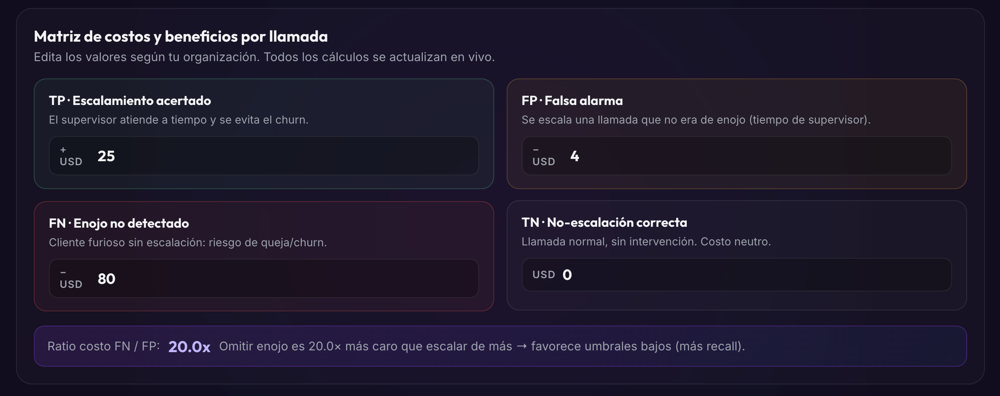

**Fase 3 · Simulador de despliegue** — escenario, modelo, umbral, volumen y prevalencia. Matriz de confusión viva + curva ROC + VPN mensual.

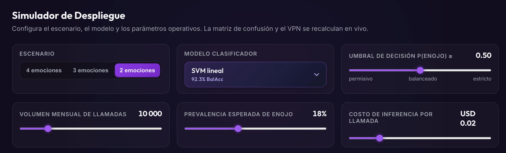

**Tarjetas de escenario** — comparativa de configuraciones disponibles (2, 3 y 4 clases).

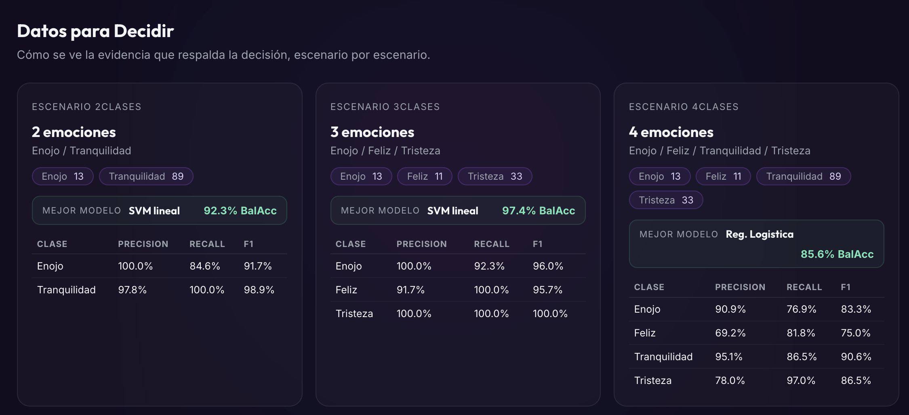

**Comparativa de escenarios** — tabla que contrasta métricas clave entre escenarios.

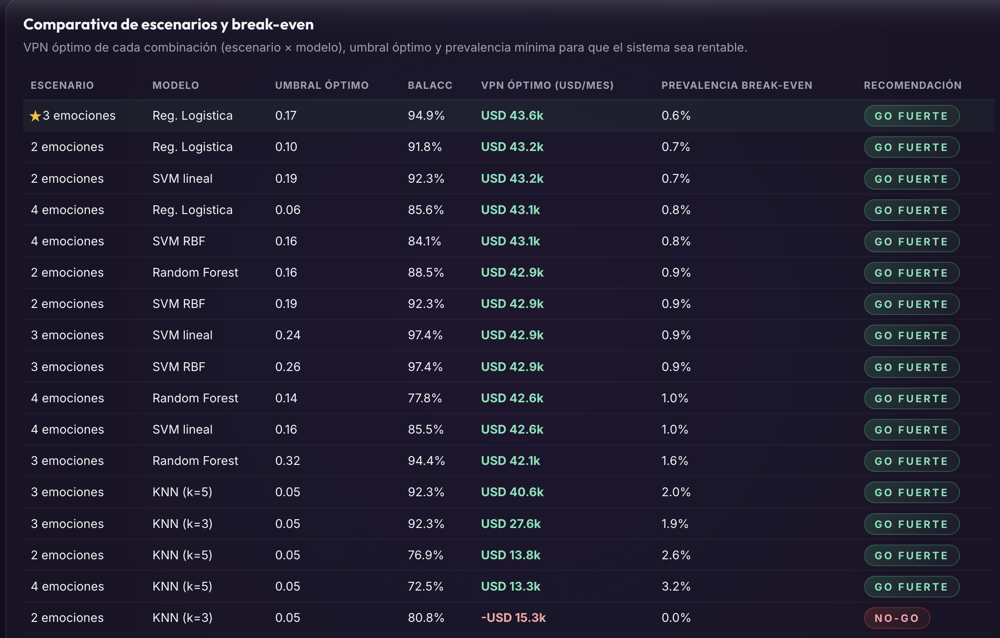

**Métricas por escenario** — precision / recall / F1 detallado por clase.

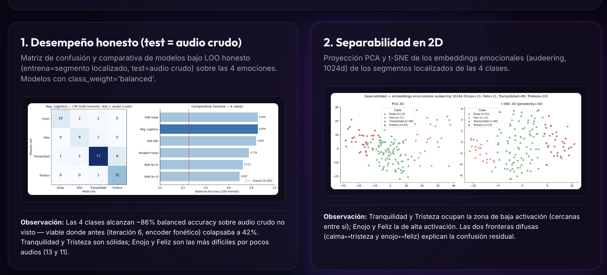

**Modelos por escenario** — balanced accuracy honesta de los 6 modelos en cada escenario.

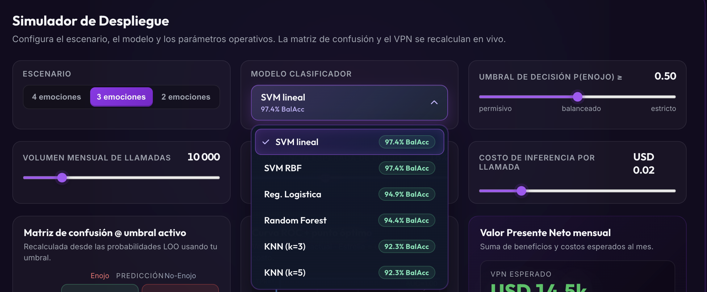

**Fase 4 · Análisis de decisiones** — tornado de sensibilidad y Monte Carlo (2 000 escenarios).

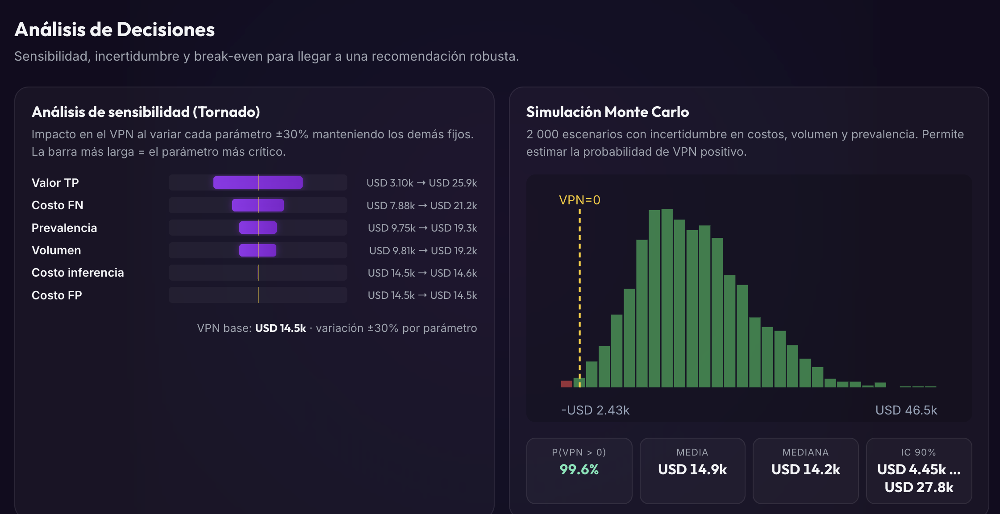

**Recomendación final** — veredicto GO / GO condicional / NO-GO con condiciones de validez.


---

## Aplicación web — pestañas disponibles

La app Flask (`app.py`, puerto 5001) levanta una interfaz con 4 pestañas:

1. **Clasificador en Vivo** — sube o graba audio y obtén la predicción con confianza y métricas acústicas. El navegador graba en `webm/opus` y el front lo convierte a WAV PCM antes de subir.
2. **Explorador del Dataset** — reproduce audios **holdout** reservados (Tranquilidad / Tristeza que no entraron al entrenamiento del modelo desplegado), de modo que cada predicción es genuinamente out-of-sample. Enojo y Feliz son clases escasas (todos sus audios están en training), así que se prueban con micrófono desde el Clasificador en Vivo.
3. **Decisiones** — simulador de negocio para un call-center: detectar Enojo para escalar llamadas, con escenarios de 2, 3 o 4 emociones. Descrito en detalle abajo.
4. **Análisis y Métricas** — matriz de confusión y separabilidad (PCA / t-SNE) con un switcher de escenarios de 2 / 3 / 4 clases.

---

## Capa 1 · Machine Learning

### Resultados

Métrica oficial: **leave-one-audio-out honesto** (train = segmento localizado, test = audio crudo de los primeros 10 s del audio excluido), estimado sobre todos los segmentos, con encoder audeering (1024 dims) y `class_weight='balanced'` donde aplica.

| Modelo | Balanced accuracy honesta (4 clases) |
|---|---|
| **Regresión Logística** | **0.856** |
| SVM lineal | 0.855 |
| SVM RBF | 0.841 |
| Random Forest | 0.778 |
| KNN (k=5) | 0.725 |
| KNN (k=3) | 0.697 |
| Baseline (chance) | 0.250 |

Por escenario, la balanced accuracy honesta del mejor clasificador es **0.92** en 2 clases (Enojo / Tranquilidad), **0.97** en 3 clases (Enojo / Feliz / Tristeza) y **0.86** en 4 clases (todas). El test leave-one-collector-out da ~0.92 en 3 clases.

### Dataset

| Parámetro | Valor |
|---|---|
| Dataset de entrenamiento | `data/procesado/` — segmentos localizados de 10 s (146 en total) |
| Segmentos por clase | Enojo 13, Feliz 11, Tranquilidad 89, Tristeza 33 |
| Clases activas | Enojo, Feliz, Tranquilidad, Tristeza |
| Segmentos usados por el modelo desplegado | 116 (se reservan 18 Tranquilidad + 12 Tristeza como holdout del dashboard) |
| Recolectores | MT, VA, ED, VZ, SG (5) |
| Duración por audio original | ~10-30 s (se procesan los primeros 10 s en evaluación honesta) |

Los prefijos MT / VA / ED / VZ / SG identifican al **recolector** del audio, no al hablante. Cada audio es de un hablante distinto.

### Clasificadores

Sobre los embeddings se entrenan 6 clasificadores clásicos: **SVM lineal, Regresión Logística, SVM RBF, Random Forest, KNN (k=5) y KNN (k=3)**, con `class_weight='balanced'` en los que lo soportan (SVMs, LogReg, RF) para compensar el desbalance de clases (Tranquilidad domina, Enojo y Feliz son escasas).

### Pipeline ML

```
1. Auditoría de etiquetas con el modelo SER
   python scripts/auditar_etiquetas_ia.py
   → A/V/D por audio, comparación con la etiqueta humana → audios_sospechosos_ia.csv

2. Localización de segmentos
   python scripts/segmentar_rescate.py
   → recorta el mejor tramo de 10 s de cada audio → data/procesado/

3. Entrenamiento + serialización + evaluación honesta
   python scripts/entrenar_procesado.py --guardar --loco
   → outputs/modelos/*.joblib (6 modelos, sin el holdout del dashboard)
   → outputs/model_metrics.json (balanced accuracy honesta + leave-one-collector-out)

4. Datos del dashboard
   python scripts/generar_datos_decisiones.py     # módulo Decisiones
   python scripts/build_experiment_history.py     # historial
   python scripts/regenerar_figuras.py            # figuras del dashboard
```

### Decisiones de diseño

| Decisión | Valor | Por qué |
|---|---|---|
| **Encoder** | `audeering/wav2vec2-large-robust-12-ft-emotion-msp-dim` | Fine-tuneado para SER; sus hidden_states son emocionales por diseño, no fonéticos. Volvió viables las 4 clases. |
| **MAX_DURATION** | 10 s | Sweet spot empírico; audios largos diluyen la señal con el mean-pool. |
| **Dataset** | Segmentos localizados de 10 s | Refinamiento de etiqueta débil sobre emoción actuada (sin segmentar el holdout). |
| **Filtro de audios** | Ninguno — todos los audios entran | Las métricas globales son demasiado toscas; la auditoría de etiquetas la hace el modelo SER. |
| **class_weight** | 'balanced' | Compensa el desbalance fuerte de clases. |
| **Modelo desplegado** | Regresión Logística (4 clases) | Mejor balanced accuracy honesta (~0.86). |

---

## Capa 2 · Toma de Decisiones

### Problema de decisión

> **Pregunta central:** un call-center evalúa desplegar un detector acústico de enojo para escalar llamadas críticas a un supervisor senior antes de que el cliente cuelgue molesto. ¿Conviene desplegarlo? Si sí, ¿con qué escenario (2 / 3 / 4 emociones), modelo y umbral?

| Elemento | Detalle |
|---|---|
| **Stakeholder** | Coordinador de Operaciones del call-center |
| **Decisión** | GO / NO-GO + configuración óptima (escenario × modelo × umbral) |
| **Métrica de éxito** | Valor Presente Neto mensual esperado (USD) |
| **Restricciones** | El modelo no puede degradar la experiencia de clientes no-enojados (falsos positivos costosos por tiempo de supervisor) |

**¿Por qué no basta con la balanced accuracy?** Esa métrica ignora el costo asimétrico entre errores: omitir a un cliente furioso (FN) puede costar mucho más que escalar a uno que no estaba enojado (FP). La decisión correcta depende de la matriz de costos del negocio, no del modelo más preciso en abstracto.

### Estructura del módulo

La pestaña **Decisiones** contiene 4 secciones secuenciales más una recomendación final. Cada sección recibe inputs de la anterior y todo se recalcula en vivo en el cliente cuando el usuario mueve un control (sin roundtrips al backend para la simulación).

```
┌──────────────────────────────────────────────────────────┐
│ 1. CONTEXTO + MATRIZ DE COSTOS (editable)                │
│    ↓ define la economía de la decisión                   │
├──────────────────────────────────────────────────────────┤
│ 2. DATOS PARA DECIDIR (evidencia por escenario)          │
│    ↓ precision/recall/F1 reales por clase                 │
├──────────────────────────────────────────────────────────┤
│ 3. SIMULADOR DE DESPLIEGUE                                │
│    Inputs: escenario (2/3/4), modelo, umbral, volumen,    │
│            prevalencia                                    │
│    Outputs: CM viva, ROC con punto óptimo, VPN mensual    │
├──────────────────────────────────────────────────────────┤
│ 4. ANÁLISIS DE DECISIONES                                 │
│    - Tornado de sensibilidad (±30% por parámetro)         │
│    - Monte Carlo (2 000 escenarios)                       │
│    - Tabla de break-even (escenario × modelo)             │
├──────────────────────────────────────────────────────────┤
│ ★ RECOMENDACIÓN FINAL                                     │
│    GO / GO condicional / NO-GO + condiciones de validez   │
└──────────────────────────────────────────────────────────┘
```

### Sección 1 · Contexto y matriz de costos

Tres tarjetas describen el contexto de negocio (stakeholder, decisión, métrica). Debajo hay una **matriz de costos editable** con 4 celdas:

| Celda | Significado | Default |
|---|---|---|
| **TP** | Escalamiento correcto → cliente atendido a tiempo, churn evitado | +USD 25 |
| **FP** | Falsa alarma → supervisor distraído sin necesidad | −USD 4 |
| **FN** | Enojo no detectado → riesgo de queja o churn | −USD 80 |
| **TN** | No-escalación correcta → operación normal | USD 0 |

La interfaz muestra el **ratio costo FN / FP** y un hint sobre cómo ese ratio sesga el umbral óptimo: ratio alto (FN ≫ FP) favorece umbrales bajos (más recall); ratio bajo favorece umbrales altos (más precisión). Cualquier cambio recalcula las secciones 3 y 4 al instante.

### Sección 2 · Datos para decidir

Renderiza la **evidencia real** que respalda la decisión, escenario por escenario: distribución de clases, mejor modelo con su balanced accuracy y una tabla de precision / recall / F1 por clase. Convierte el output del clasificador en evidencia inspeccionable antes de simular.

### Sección 3 · Simulador de despliegue

La sección más interactiva, con 6 controles:

| Control | Qué ajusta | Default |
|---|---|---|
| **Escenario** | 2, 3 o 4 emociones | 4 emociones |
| **Modelo** | Cualquiera de los 6 clasificadores (ordenados por balanced accuracy) | mejor del escenario |
| **Umbral P(Enojo) ≥** | Umbral de decisión binaria sobre la probabilidad de Enojo | 0.50 |
| **Volumen mensual** | Llamadas/mes proyectadas | 10 000 |
| **Prevalencia de Enojo** | % de llamadas que realmente son enojo en producción | 18 % |
| **Costo de inferencia** | USD por llamada procesada | USD 0.02 |

Tres outputs en vivo: (1) **matriz de confusión** recalculada desde las probabilidades moviendo el umbral, con Recall / Precision / F1 / FPR; (2) **curva ROC + punto óptimo** (verde = operación actual, estrella = umbral que maximiza el VPN); (3) **VPN mensual + desglose** (verde si positivo, rojo si negativo).

### Sección 4 · Análisis de decisiones

- **Tornado de sensibilidad** — varía ±30 % por parámetro (FN, FP, TP, prevalencia, volumen, costo de inferencia) y mide el rango de VPN.
- **Monte Carlo (2 000 escenarios)** — ruido triangular en costos, volumen y prevalencia; devuelve P(VPN > 0), media, mediana e IC90 %.
- **Tabla de break-even (escenario × modelo)** — para cada combinación calcula el umbral óptimo, el VPN óptimo, la prevalencia mínima rentable y el veredicto.

### Recomendación final

Tarjeta de cierre con badge **GO / GO condicional / NO-GO**:

| Veredicto | Criterio |
|---|---|
| **GO** | VPN óptimo > USD 1 000 y P(VPN > 0) ≥ 75 % en Monte Carlo |
| **GO condicional** | P(VPN > 0) ≥ 55 % |
| **NO-GO** | Cualquier otra condición |

### Modelo matemático

**Predicción binaria desde probabilidades.** Para cada muestra `i` con vector de probabilidades `p_i`:

```
ŷ_i = 1  si  p_i[Enojo] ≥ θ
ŷ_i = 0  en otro caso
```

**Valor neto mensual esperado:**

```
TPR = TP / (TP + FN)              (recall)
FPR = FP / (FP + TN)
FNR = 1 - TPR ;  TNR = 1 - FPR

V_pos = Volumen × Prevalencia
V_neg = Volumen × (1 - Prevalencia)

E[TP] = V_pos × TPR ;  E[FN] = V_pos × FNR
E[FP] = V_neg × FPR ;  E[TN] = V_neg × TNR

VPN = E[TP]·valor_TP − E[FP]·costo_FP − E[FN]·costo_FN − E[TN]·costo_TN
      − Volumen·costo_inferencia − costo_fijo_mensual
```

**Umbral óptimo:** búsqueda lineal sobre θ ∈ [0.05, 0.95] con paso 0.01 maximizando el VPN.

### Origen y validez de los valores económicos

Los valores de costo por defecto **no provienen de datos confidenciales de una empresa real**: son **valores ilustrativos calibrados con benchmarks de industria publicados**, elegidos para que el orden de magnitud y las relaciones entre ellos sean defendibles. La interfaz permite reemplazarlos con datos propios.

| Parámetro | Default | Fuente / benchmark |
|---|---|---|
| **Costo FN** | USD 80 | Reichheld & Sasser, HBR (1990); Salesforce State of the Connected Customer (2023). |
| **Costo FP** | USD 4 | U.S. BLS — Customer Service Supervisors OEWS 2023. |
| **Valor TP** | USD 25 | Bain & Company — *Prescription for cutting costs*. |
| **Costo de inferencia** | USD 0.02/llamada | AWS Transcribe, Azure Speech, Google Cloud STT (2024). |
| **Costo fijo mensual** | USD 1 200 | AWS EC2 `g4dn.xlarge` + monitoring + ingeniería prorrateada. |
| **Volumen 10 000 llamadas/mes** | — | ContactBabel + ICMI benchmarks 2023. |
| **Prevalencia 18 % de Enojo** | — | NICE inContact CX Transformation Benchmark (2023). |

El tornado de sensibilidad y el Monte Carlo existen precisamente para validar que la recomendación sobrevive a errores en estos valores.

---

## Módulos compartidos: config.py y emotion_encoder.py

Estos dos archivos no son scripts ejecutables — son módulos importados por casi todos los scripts del pipeline. Tocarlos tiene efecto cascada sobre entrenamiento, auditoría e inferencia.

### `config.py` — fuente de verdad global

```python
N_PER_CLASS        = int(os.environ.get("N_PER_CLASS", 15))
MIN_SCORE          = 0.0   # filtro acústico desactivado
ACTIVE_CLASSES     = ["Enojo", "Feliz", "Tranquilidad", "Tristeza"]
DASHBOARD_HOLDOUT  = {"Tranquilidad": 18, "Tristeza": 12}
DASHBOARD_HOLDOUT_SEED = 42
```

| Parámetro | Efecto al cambiarlo |
|---|---|
| `N_PER_CLASS` | Cuántos audios por clase entran al entrenamiento. Soporta override por env var (`N_PER_CLASS=20 python ...`). |
| `MIN_SCORE` | Umbral mínimo de score acústico para incluir un audio. En `0.0` todos los audios pasan (filtro desactivado). |
| `ACTIVE_CLASSES` | Clases que participan en el entrenamiento y en la app. Quitar una clase y re-correr el pipeline actualiza modelos, métricas y dashboard automáticamente. |
| `DASHBOARD_HOLDOUT` | Cuántos audios de cada clase se reservan para el Explorador del Dataset (nunca entran a training). |
| `DASHBOARD_HOLDOUT_SEED` | Semilla de aleatoriedad para la selección del holdout. Fijada para reproducibilidad. |

Cambiar cualquier parámetro y re-correr el pipeline completo (`segmentar_rescate.py` → `entrenar_procesado.py --guardar` → scripts de dashboard) regenera embeddings, modelos, métricas y dashboard de forma consistente.

### `emotion_encoder.py` — encoder audeering compartido

Importado por: `auditar_etiquetas_ia.py`, `exportar_modelos.py`, `segmentar_rescate.py`, `entrenar_procesado.py`, `app.py`. Las cinco capas ven exactamente las mismas representaciones porque todas pasan por este módulo.

```python
MODEL_ID      = "audeering/wav2vec2-large-robust-12-ft-emotion-msp-dim"
EMBEDDING_DIM = 1024
```

**Funciones exportadas:**

| Función | Entrada | Salida | Uso |
|---|---|---|---|
| `load_encoder()` | — | `(processor, model, device)` | Se llama una vez al iniciar cualquier script que necesite el encoder. Mueve el modelo a `mps`/`cuda`/`cpu` según disponibilidad. |
| `extract_embedding(audio, sr, processor, model, device)` | array de audio + sample rate | vector de 1024 dims (hidden state del encoder) | Entrenamiento e inferencia en producción. |
| `extract_avd(audio, sr, processor, model, device)` | array de audio + sample rate | `(arousal, valence, dominance)` — floats en [0,1] | Auditoría de etiquetas y localización de segmentos. |

`extract_embedding` y `extract_avd` usan el mismo forward pass pero devuelven salidas distintas del modelo: `extract_embedding` toma el `hidden_state` (1024-d, rico en representación emocional), mientras `extract_avd` toma la cabeza de regresión final (3 valores A/V/D, directamente interpretables).

El modelo (~1.2 GB) se descarga la primera vez y se cachea en `~/.cache/huggingface/`.

---

## Scripts — referencia completa

### Auditoría de etiquetas

**`auditar_etiquetas_ia.py`**
Recorre todos los audios originales (`data/AUDIOS MACHINE LEARNING/`), extrae A/V/D con `emotion_encoder.extract_avd()`, mapea esos valores a las 4 clases mediante kernels gaussianos y compara con la etiqueta humana del nombre del archivo. Escribe `outputs/audios_sospechosos_ia.csv` con la predicción del modelo, el delta de score y el campo `suena_a` (la clase a la que el modelo cree que suena). No modifica el dataset — es solo diagnóstico.

```bash
python scripts/auditar_etiquetas_ia.py
```

**`mostrar_todos.py`**
Imprime en consola los scores audeering de **todos** los audios del dataset, ordenados por clase. Útil para inspección manual del estado completo antes de decidir qué audios revisar.

```bash
python scripts/mostrar_todos.py
```

**`mostrar_sospechosos.py`**
Filtra y muestra solo los audios cuya etiqueta humana discrepa del predicho por el modelo SER (los que están en `audios_sospechosos_ia.csv`). Punto de partida para decidir si un audio debe excluirse o corregirse.

```bash
python scripts/mostrar_sospechosos.py
```

---

### Localización de segmentos

**`segmentar_rescate.py`**
Aplica una ventana deslizante de 10 s sobre el audio completo (no solo los primeros 10 s), puntúa cada ventana con `emotion_encoder.extract_avd()` para la clase declarada y guarda el tramo de máximo score en `data/procesado/`. También escribe `outputs/mejores_segmentos.csv` con el offset y score del mejor tramo de cada audio.

```bash
python scripts/segmentar_rescate.py
```

Requiere que el directorio `data/AUDIOS MACHINE LEARNING/` tenga los audios originales (gitignored). El directorio `data/procesado/` resultante es el dataset de entrenamiento.

---

### Entrenamiento y serialización

**`exportar_modelos.py`** *(módulo compartido, no ejecutar directamente)*
Expone dos elementos compartidos que otros scripts importan:

- `MODEL_SPECS` — diccionario con los 6 clasificadores y sus hiperparámetros (`LogisticRegression`, `SVC` lineal, `SVC` RBF, `RandomForestClassifier`, `KNeighborsClassifier` k=3 y k=5, todos con `class_weight='balanced'` donde aplica).
- `extraer_embedding(path, processor, model, device)` — extrae el embedding de 1024 dims de un archivo de audio individual.

Su bloque `__main__` es obsoleto (supersedido por `entrenar_procesado.py`). No ejecutar directamente.

**`entrenar_procesado.py`** *(script principal de entrenamiento)*
Lee los segmentos de `data/procesado/`, separa el holdout del dashboard (`DASHBOARD_HOLDOUT` de `config.py`) y entrena los 6 clasificadores con evaluación **leave-one-audio-out honesta** (train = segmento localizado del audio, test = audio crudo de los primeros 10 s del audio dejado fuera).

```bash
# Evaluar y serializar modelos + holdout del dashboard
python scripts/entrenar_procesado.py --guardar

# Además, correr leave-one-collector-out
python scripts/entrenar_procesado.py --guardar --loco
```

Salidas con `--guardar`:
- `outputs/modelos/*.joblib` — 6 clasificadores entrenados sobre todos los audios menos el holdout del dashboard
- `outputs/model_metrics.json` — balanced accuracy honesta por modelo (LOAO) y leave-one-collector-out (LOCO)
- `outputs/proc_embeddings.npz` — embeddings cacheados (segmento + crudo) para los scripts de dashboard
- `outputs/holdout_dashboard.json` — metadatos de los audios reservados para el Explorador del Dataset

---

### Generación del dashboard

**`generar_datos_decisiones.py`**
Lee `proc_embeddings.npz` y los modelos `.joblib`, recalcula probabilidades LOO y matrices de confusión por escenario (2, 3 y 4 clases), y escribe `outputs/decisions_data.json`. Este JSON es el que consume el front para el simulador de decisiones — sin este archivo la pestaña Decisiones no carga.

```bash
python scripts/generar_datos_decisiones.py
```

**`build_experiment_history.py`**
Construye `outputs/experiment_history.json` con el historial de experimentos que muestra el switcher de la pestaña Análisis y Métricas. Lee `proc_embeddings.npz` y los modelos `.joblib`.

```bash
python scripts/build_experiment_history.py
```

**`regenerar_figuras.py`**
Genera los gráficos de PCA / t-SNE y matrices de confusión que se sirven desde `outputs/figuras/`. Requiere que `proc_embeddings.npz` esté actualizado.

```bash
python scripts/regenerar_figuras.py
```

---

## Notebook del pipeline

### `EmotiSpeech_pipeline.ipynb`
Notebook principal del proyecto. Ejecuta el pipeline completo de extremo a extremo llamando a cada script, y ofrece visualizaciones en cada paso:

1. **Auditoría de etiquetas** — corre `auditar_etiquetas_ia.py`, visualiza la distribución A/V/D en el espacio circumplex, box plots por clase y tabla de audios sospechosos.
2. **Localización de segmentos** — corre `segmentar_rescate.py`, muestra la distribución de estados (OK / RESCATADO / SIN_RESCATE) y el histograma de mejoras de score.
3. **Exploración del dataset** — distribución de segmentos por clase y por recolector.
4. **Entrenamiento** — corre `entrenar_procesado.py --guardar --loco`, muestra la tabla comparativa (LOOCV sobre segmentos vs honesto) y el gráfico de balanced accuracy por modelo.
5. **Exploración de embeddings** — PCA 2D, t-SNE 2D, y comparación del espacio de segmentos vs audio crudo.
6. **Evaluación detallada** — LOOCV honesto en memoria, matriz de confusión del mejor modelo y heatmap de recall por clase × modelo.
7. **Dashboard** — corre los 3 scripts de dashboard y muestra las figuras generadas inline.
8. **Inferencia de ejemplo** — predice sobre un audio del holdout con los 6 modelos serializados.

Las celdas pesadas (requieren el encoder ~1.2 GB) saltan la ejecución si el output ya existe. Poner `FORCE_RERUN = True` en la celda de setup para forzar re-ejecución.

---

## Estructura del proyecto

```
clasificador-audios/
├── app.py                                     # Flask backend (puerto 5001)
├── config.py                                  # N_PER_CLASS, ACTIVE_CLASSES, DASHBOARD_HOLDOUT
├── emotion_encoder.py                         # Encoder audeering compartido (training + auditoría + inferencia)
├── templates/
│   └── index.html                             # 4 pestañas
├── static/
│   ├── css/
│   │   ├── base.css                           # Variables CSS, reset, layout global
│   │   ├── components.css                     # Header, nav, cards, botones, upload, recording
│   │   ├── predictions.css                    # Panel de resultados, badges, barras, métricas
│   │   ├── dataset.css                        # Tabla del explorador de dataset
│   │   ├── analytics.css                      # Switcher de experimentos, figuras
│   │   ├── decisions.css                      # Módulo de Toma de Decisiones (simulador, tornado, etc.)
│   │   └── toast.css                          # Sistema de notificaciones
│   └── js/main.js                             # Simulador de decisiones en cliente
├── notebooks/
│   └── EmotiSpeech_pipeline.ipynb             # Pipeline completo: auditoría → segmentación → training → visualizaciones
├── imgs/                                      # Capturas de la interfaz para el README
├── scripts/
│   ├── auditar_etiquetas_ia.py                # Auditoría de etiquetas con modelo SER
│   ├── mostrar_todos.py                       # Scores audeering de TODOS los audios
│   ├── mostrar_sospechosos.py                 # Solo los audios cuya etiqueta discrepa de la IA
│   ├── segmentar_rescate.py                   # Localización: mejor segmento de 10 s por audio
│   ├── exportar_modelos.py                    # Módulo compartido: MODEL_SPECS + extraer_embedding()
│   ├── entrenar_procesado.py                  # Entrena + serializa + evalúa honesto + leave-one-collector-out
│   ├── generar_datos_decisiones.py            # Data del módulo Decisiones
│   ├── build_experiment_history.py            # Historial para el dashboard
│   └── regenerar_figuras.py                   # Regenera figuras del dashboard
├── outputs/
│   ├── audios_sospechosos_ia.csv              # Auditoría IA: A/V/D + delta + suena_a
│   ├── mejores_segmentos.csv                  # Reporte de localización por audio
│   ├── model_metrics.json                     # Balanced accuracy honesta + descripción por modelo
│   ├── experiment_history.json
│   ├── decisions_data.json                    # Data para el módulo Decisiones
│   ├── holdout_dashboard.json                 # Audios crudos reservados para el explorador
│   ├── proc_embeddings.npz                    # Embeddings 1024-d cacheados (segmento + crudo)
│   ├── modelos/                               # 6 clasificadores serializados (.joblib)
│   └── figuras/                               # Gráficos del dashboard
├── data/                                      # Dataset (gitignored)
│   ├── AUDIOS MACHINE LEARNING/               # Originales por clase
│   └── procesado/                             # Dataset de entrenamiento: mejor segmento de 10 s por audio (146)
└── README.md
```

Los `.npz` y `data/` están gitignored pero son regenerables corriendo el pipeline.

---

## Uso rápido

```bash
# 1. Activar entorno (vive un nivel arriba)
source ../.venv/bin/activate

# 2. Auditar etiquetas con el modelo SER
python scripts/auditar_etiquetas_ia.py
python scripts/mostrar_todos.py          # (opcional) inspeccionar scores de todos los audios
python scripts/mostrar_sospechosos.py    # (opcional) solo los discrepantes

# 3. Localizar el mejor segmento de 10 s de cada audio → data/procesado/
python scripts/segmentar_rescate.py

# 4. Entrenar + serializar + evaluar honesto y leave-one-collector-out
python scripts/entrenar_procesado.py --guardar --loco

# 5. Refrescar la data del dashboard
python scripts/generar_datos_decisiones.py
python scripts/build_experiment_history.py
python scripts/regenerar_figuras.py

# 6. Levantar la app
python app.py
# http://127.0.0.1:5001
```

`config.py` es la única fuente de verdad para `ACTIVE_CLASSES`, el holdout del dashboard y los parámetros de selección. Cambiar esos parámetros y re-correr el pipeline regenera embeddings, modelos, métricas y dashboard de forma consistente.

---

## Dependencias

```
flask
librosa>=0.10
torch>=2.0
transformers>=4.40        # audeering requiere transformers reciente
scikit-learn>=1.3
joblib
numpy
pandas
matplotlib
soundfile
```

El modelo `audeering/wav2vec2-large-robust-12-ft-emotion-msp-dim` (~1.2 GB) se descarga la primera vez y se cachea en `~/.cache/huggingface/`. Se mueve a `mps`/`cuda` si están disponibles, si no a `cpu`.

---

## Contexto académico

Proyecto integrado de dos cursos:

- **Machine Learning** — pipeline de clasificación de emociones (capa 1).
- **Toma de Decisiones** — módulo analítico de simulación, sensibilidad y recomendación (capa 2).

Dataset recolectado por 5 personas (prefijos MT, VZ, VA, ED, SG) con ~10-30 s por audio. Cada audio es de un hablante distinto.
