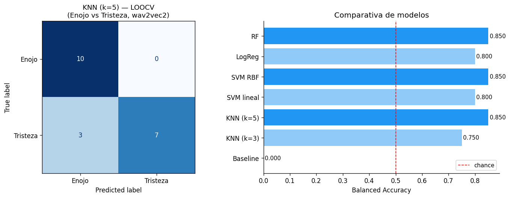
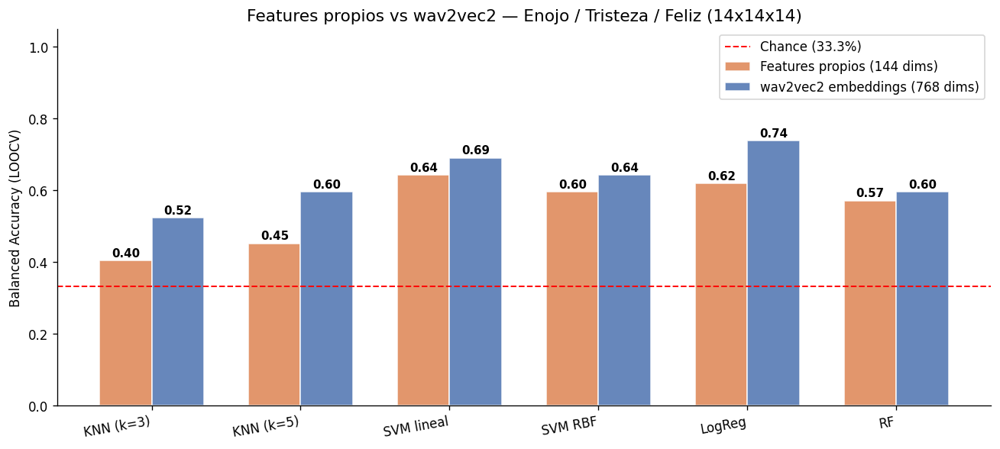

# Clasificador de Emociones en Voz
## Reconocimiento acustico de emociones con features clasicos y wav2vec2

Proyecto de clasificacion de emociones a partir de audio de voz.
Evalua dos enfoques: features acusticos manuales (144 dims) y embeddings
de `facebook/wav2vec2-base` (768 dims), ambos con Leave-One-Out CV.

---

## Resultado principal

Con el dataset filtrado y balanceado (top-13 por clase, Enojo vs Tristeza - 26 audios en total):

| Enfoque | Mejor modelo | Accuracy | Balanced Acc |
|---|---|---|---|
| Features manuales (144 dims) | SVM lineal / Random Forest | **0.85** | **0.8462** |
| wav2vec2 embeddings (768 dims) | SVM lineal / Regresión Logística | **0.92** | **0.9231** |

Con la ampliación de la muestra a 13 audios por clase, el modelo de representación profunda (*wav2vec2*) logra extraer mejores descriptores prosódicos y tímbricos, superando a los features acústicos clásicos en un **7.69%** de Balanced Accuracy.

### Gráficos de Resultados y Comparativa

A continuación se presentan las figuras generadas a partir del entrenamiento y evaluación del clasificador (`outputs/figuras/`):

#### 1. Matriz de Confusión y Desempeño (wav2vec2)


#### 2. Comparativa Features Clásicos vs wav2vec2


---

## Dataset

| Parametro | Valor |
|---|---|
| Total de audios | 146 |
| Clases originales | Aburrido (36), Enojo (37), Tranquilidad (36), Tristeza (37) |
| Recolectores | MT, VZ, VA, ED |
| Duracion por audio | ~10-30 segundos |
| Formatos | .ogg, .mp4, .mpeg |

### Audios utiles por clase (score > 0.35)

| Clase | Total | Pasan (>0.35) | Excelentes (>0.45) |
|---|---|---|---|
| Enojo | 37 | 36 | 33 |
| Tranquilidad | 36 | 27 | 14 |
| Tristeza | 37 | 11 | 4 |

Tristeza es el cuello de botella: los recolectores VA y ED no expresaron
la emocion con suficiente intensidad acustica (energia muy alta, pitch
muy variable para ser tristeza).

---

## Estructura del proyecto

```
clasificador-audios/
├── notebooks/
│   ├── 01_clasificador_v1_features.ipynb      # Features manuales (144 dims)
│   ├── 02_clasificador_v1_embeddings.ipynb    # wav2vec2 embeddings (768 dims)
│   └── 03_clasificador_v2_balanceado.ipynb    # Comparativa final + conclusiones
├── scripts/
│   └── filtrar_audios.py                      # Scoring acustico por audio
├── outputs/
│   ├── reporte_filtrado_v2.csv                # Scores de los 146 audios
│   └── figuras/                               # Graficos generados
├── data/                                      # (no versionado)
│   └── AUDIOS MACHINE LEARNING/               # Dataset original (146 audios)
├── .gitignore
└── README.md
```

---

## Pipeline

```
1. Scoring acustico (scripts/filtrar_audios.py)
   - Calcula 4 scores por audio: enojo, tristeza, tranquilidad, neutro
   - NO reasigna etiquetas — cada audio mantiene su clase original
   - Genera reporte con ranking completo y estado (EXCELENTE/PASA/borderline/NO PASA)

2. Seleccion por ranking (en los notebooks)
   - Top-N audios de cada clase ordenados por su score correspondiente
   - Permite elegir la configuracion segun el experimento

3. Extraccion de features
   - Features manuales: pitch, energia, ZCR, spectral, MFCCs (144 dims)
   - wav2vec2: mean-pooling de la ultima capa oculta (768 dims)

4. Clasificacion con LOOCV
   - KNN, SVM lineal, SVM RBF, LogReg, Random Forest
   - Metrica principal: Balanced Accuracy
```

---

## Uso rapido

```bash
# Activar entorno
source ../.venv/bin/activate

# Calcular scores de todos los audios
python scripts/filtrar_audios.py

# Ver ranking completo, 15 peores y configuraciones sugeridas en terminal
# El reporte se guarda en outputs/reporte_filtrado_v2.csv

# Ejecutar notebook principal (comparativa completa)
jupyter notebook notebooks/03_clasificador_v2_balanceado.ipynb
```

---

## Hallazgos del proceso

### Por que solo 2 clases funcionan bien?

El dataset tiene 4 clases originales. Tres de ellas (Aburrido, Tranquilidad,
Tristeza) son acusticamente similares — baja energia, pitch bajo, poca
variabilidad. Solo Enojo tiene una firma acustica marcada y consistente.

Al reducir a Enojo vs Tristeza (las dos mas opuestas), el problema se vuelve
resoluble con cualquier clasificador.

### ¿Por qué wav2vec2 supera a los features manuales?

Al ampliar el dataset a 26 muestras (13 por clase), los embeddings de wav2vec2 logran capitalizar su preentrenamiento en 960h de voz (LibriSpeech) para capturar dinámicas prosódicas y tímbricas de más alto nivel, logrando un **92.31%** de balanced accuracy frente al **84.62%** de los features acústicos tradicionales.

### Por que el filtrado es importante?

Muchos audios etiquetados como "Tristeza" o "Enojo" suenan neutros — la persona
no expreso la emocion con suficiente intensidad. El script de scoring permite
identificar y descartar esos audios antes de entrenar.

### Tristeza: el problema de los nuevos recolectores

Con 2 recolectores (MT y VZ): 10-11 audios de tristeza utiles.
Con 4 recolectores (MT, VZ, VA, ED): sigue habiendo 11 utiles.

VA y ED grabaron tristeza con voz activa (energia -22 a -27 dB, pitch variable),
cuando la firma acustica de tristeza requiere voz plana y baja (energia < -35 dB,
pitch_std < 2). Sus grabaciones no tienen la expresividad emocional necesaria.

---

## Proximos pasos

- Agregar clase Felicidad (alta energia + pitch alto + brillo espectral alto)
  para tener 3 clases acusticamente distintas: Enojo / Felicidad / Tranquilidad
- Regrabar audios de Tristeza con VA y ED con instrucciones mas especificas
  (voz mas lenta, mas baja, mas monotona)
- Evaluar con mas datos si wav2vec2 supera a features manuales

---

## Dependencias

```
librosa>=0.10
torch>=2.0
transformers>=4.30
scikit-learn>=1.3
numpy
pandas
matplotlib
```

---

## Contexto academico

Proyecto del curso Intro-Machine-Learning (pregrado).
Dataset recolectado por 4 personas (MT, VZ, VA, ED), ~21 hablantes distintos
por recolector, ~10-30 segundos por audio.
